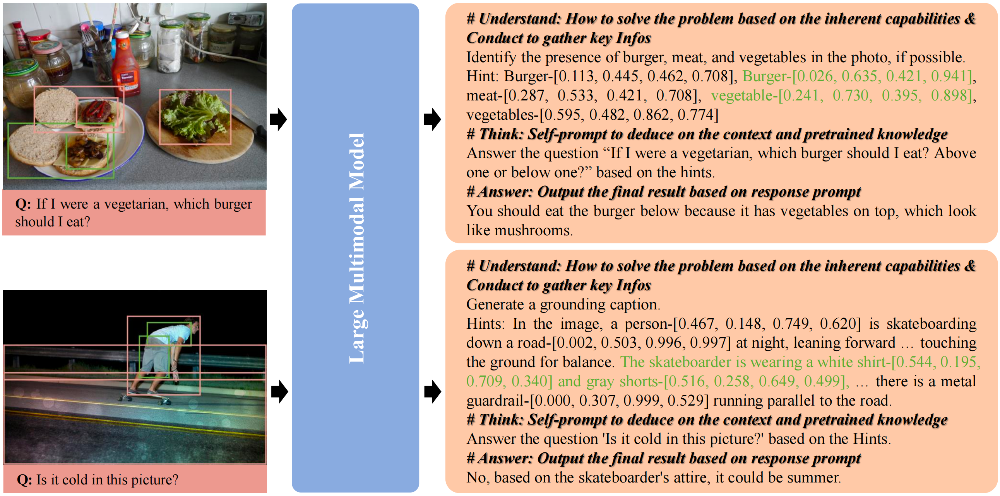
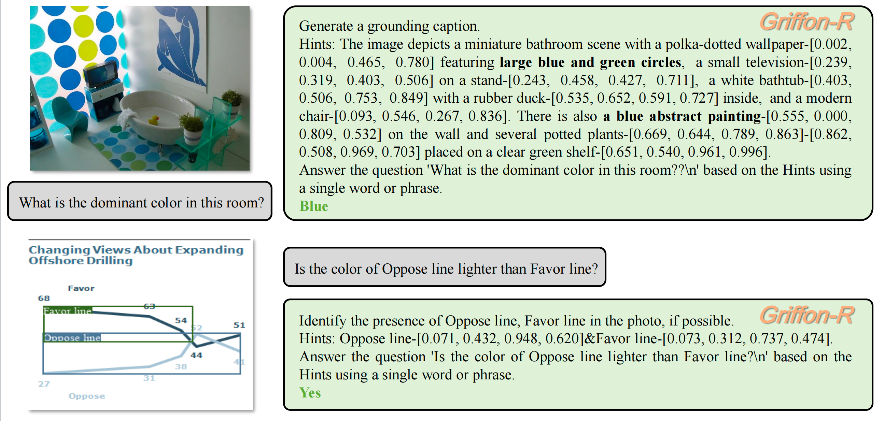

<h1>  Understand, Think, and Answer: Advancing Visual Reasoning with Large Multimodal Models </h1>

<h5 align="center"> If you find this project useful, please give us a star🌟.

<h5 align="center"> 

<!-- 

 -->

</h5>

## News
- [x] **`May 27, 2025.`** **We have released our paper in the [arxiv](https://arxiv.org/abs/2505.20753). Data and model will be released soon.**

## Introduction

Unlike existing LMMs that rely on shortcut learning or chained inference, Griffon-R introduces **a unified, single-pass mechanism that mimics human-like understanding-thinking-answering**. **It bridges foundational visual capabilities with high-level reasoning to produce faithful, traceable answers — no external tools or multiple passes required.** We also release 334K curated visual instruction samples spanning diverse scenes and reasoning challenges, fueling Griffon-R’s strong generalization across benchmarks like VSR, CLEVR, MMBench, and ScienceQA.

## Demo
