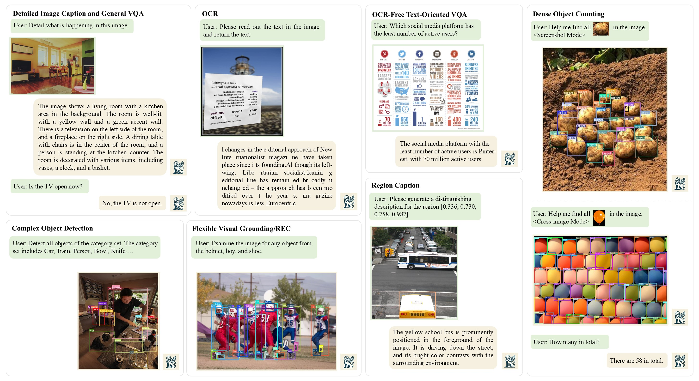

<div align="center">

# Welcome to Griffon

</div>

This is the official repository for the Griffon series (v1, v2, and G). Griffon is the first high-resolution (over 1K) LVLM capable of performing fine-grained visual perception tasks, such as object detection and counting. In its latest version, Griffon integrates vision-language and vision-centric tasks within a unified end-to-end framework. You can interact with Griffon and request it to complete various tasks. The model is continuously evolving towards greater intelligence to handle more complex scenarios. Feel free to follow Griffon and reach out to us by raising an issue.

---

**Griffon-G: Bridging Vision-Language and Vision-Centric Tasks via Large Multimodal Models（Latest）**

[`📕Paper`](https://arxiv.org/abs/2410.16163) [`🌀Usage`](./README.md) [`🤗Model(NEW)`](https://huggingface.co/collections/JefferyZhan/griffon-g-6729d8d65cd58b3f40e87794)

Griffon v2: Advancing Multimodal Perception with High-Resolution Scaling and Visual-Language Co-Referring

[`📕Paper`](https://arxiv.org/abs/2403.09333) [`🌀Intro`](./docs/README_v2.md)

Griffon: Spelling out All Object Locations at Any Granuality with Large Language Model 

[`📕Paper`](https://arxiv.org/abs/2311.14552) [`🌀Usage`](./docs/README_v1.md) [`🤗Model`](https://huggingface.co/JefferyZhan/Griffon/tree/main)


## Release
- [x] **`2024.11.26`** 🔥We are glad to release inference code and the model of Griffon-G in [`🤗Griffon-G`](https://huggingface.co/collections/JefferyZhan/griffon-g-6729d8d65cd58b3f40e87794). Training codes will be released later.
- [x] **`2024.07.01`** 🔥**Griffon has been accepted to ECCV 2024. Data is released in [`🤗HuggingFace`](https://huggingface.co/datasets/JefferyZhan/Language-prompted-Localization-Dataset)**
- [x] **`2024.03.11`** 🔥We are excited to announce the arrival of Griffon v2. Griffion v2 brings fine-grained perception performance to new heights with high-resolution expert-level detection and counting and supports visual-language co-referring. Take a look at our demo first. Paper is preprinted in [`📕Arxiv`](https://arxiv.org/abs/2403.09333).
- [x] **`2023.12.06`** 🔥Release the Griffon v1 inference code and model in [`🤗HuggingFace`](https://huggingface.co/JefferyZhan/Griffon/tree/main).
- [x] **`2023.11.29`** 🔥Griffon v1 Paper has been released in [`📕Arxiv`](https://arxiv.org/abs/2311.14552).

## What can Griffon do now?
Griffon-G demonstrates advanced performance across multimodal benchmarks, general VQAs, and text-rich VQAs, achieving new state-of-the-art results in REC and object detection.
 **More quantitative evaluation results can be found in our paper.**


## Get Started

#### 1.Clone & Install
---
```shell
git clone git@github.com:jefferyZhan/Griffon.git
cd Griffon
pip install -e .
```
Tips: If you encounter any errors while installing the packages, you can always download the corresponding source files (*.whl), which have been verified by us.

#### 2.Download the Griffon and CLIP models to the checkpoints folder.
---
| Model                                | Links                                  |
|---------                            |---------------------------------------|
| Griffon-G-9B                        | [`🤗HuggingFace`](https://huggingface.co/JefferyZhan/Griffon-G-gemma2-9B)    |
| Griffon-G-27B                        | [`🤗HuggingFace`](https://huggingface.co/JefferyZhan/Griffon-G-gemma2-27B/tree/main)    |
| clip-vit-large-path14               | [`🤗HuggingFace`](https://huggingface.co/openai/clip-vit-large-patch14)    |
| clip-vit-large-path14-336_to_1022   | [`🤗HuggingFace`](https://huggingface.co/JefferyZhan/clip-vit-large-path14-336_to_1022/tree/main)    |

#### 3.Inference
---
```shell
# 3.1 Modify the instruction in the run_inference.sh.

# 3.2.1 DO NOT USE Visual Prompt
bash run_inference.sh [CUDA_ID] [CHECKPOINTS_PATH] [IMAGE_PATH]

# 3.2.2 USE Visual Prompt for COUNTING: Input both query image and prompt image splited with comma and specify <region> placeholder in the instruction
bash run_inference.sh [CUDA_ID] [CHECKPOINTS_PATH] [IMAGE_PATH,PROMPT_PATH]
```
Notice: Please pay attention to the singular and plural expressions of objects.

## Acknowledgement

- [LLaVA](https://github.com/haotian-liu/LLaVA/tree/main) provides the base codes and pre-trained models.
- [Shikra](https://github.com/shikras/shikra) provides insight of how to organize datasets and some base processed annotations.
- [Llama](https://github.com/facebookresearch/llama) provides the large language model.
- [Gemma2](https://arxiv.org/abs/2408.00118) provides the large language model.
- [volgachen](https://github.com/volgachen/Awesome-AI-Environment) provides the basic environment setting config.

## Citation
If you find Griffon useful for your research and applications, please cite using this BibTeX:
```bibtex
@inproceedings{zhan2025griffonv1,
  title={Griffon: Spelling out all object locations at any granularity with large language models},
  author={Zhan, Yufei and Zhu, Yousong and Chen, Zhiyang and Yang, Fan and Tang, Ming and Wang, Jinqiao},
  booktitle={European Conference on Computer Vision},
  pages={405--422},
  year={2025},
  organization={Springer}
}

@misc{zhan2024griffonv2,
      title={Griffon v2: Advancing Multimodal Perception with High-Resolution Scaling and Visual-Language Co-Referring}, 
      author={Yufei Zhan and Yousong Zhu and Hongyin Zhao and Fan Yang and Ming Tang and Jinqiao Wang},
      year={2024},
      eprint={2403.09333},
      archivePrefix={arXiv},
      primaryClass={cs.CV}
}

@article{zhan2024griffon-G,
  title={Griffon-G: Bridging Vision-Language and Vision-Centric Tasks via Large Multimodal Models},
  author={Zhan, Yufei and Zhao, Hongyin and Zhu, Yousong and Yang, Fan and Tang, Ming and Wang, Jinqiao},
  journal={arXiv preprint arXiv:2410.16163},
  year={2024}
}
```

## License

[](https://github.com/tatsu-lab/stanford_alpaca/blob/main/LICENSE)
[](https://github.com/tatsu-lab/stanford_alpaca/blob/main/DATA_LICENSE)

The data and checkpoint is licensed for research use only. All of them are also restricted to uses that follow the license agreement of LLaVA, LLaMA, Gemma2, and GPT-4. The dataset is CC BY NC 4.0 (allowing only non-commercial use) and models trained using the dataset should not be used outside of research purposes.