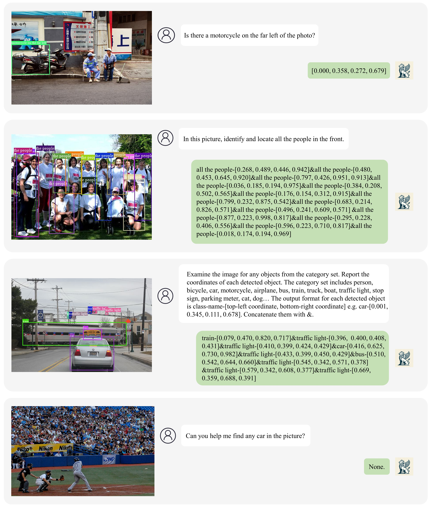

<!-- # 🦖 DETVAVA -->

# Welcome to Griffon

This is the offical repo of the paper **Griffon: Spelling out All Object Locations at Any Granuality with Large Language Model**. Griffon is a strong baseline firstly capable of localizing objects based on the free-form texts at any granularity. Surpassing previous localization-related Large Vision Language Models, Griffon can handle all localization scenarios in real world for daily usage. This is the first version of Griffon. We will upgrade Griffon continously, equipping it with more precise capabilities in the localization and other instance-level tasks, e.g. Referring Comprehension Segmentation and Instance Segmentation. Also, corresponding datasets will be improved too. Welcome to follow this repo.

## What can Griffon do?
Griffon can perform localization with free-form text inputs. The command may direct to a single referent, a gropup of objects represented by a category name or a phase, and plenty of categories. Also, if you are not sure whether an instance appear in the image, Griffon can help. We provide some demo images to show how to use Griffon, and more demos can be found in our paper.

## Performance

## TODO List
- [x] Paper has been released in [`📕Arxiv`](https://arxiv.org/abs/2311.14552).
- [ ] Release the Language-prompted Detection Dataset.
- [ ] Release the online demo.
- [ ] Release the inference code and model.
- [ ] Integrate the segmentation function.
- [ ] Improve performance continously...

## Demo

## Acknowledgement

- [LLaVA](https://github.com/haotian-liu/LLaVA/tree/main) provides the base codes and pre-trained models.
- [Shikra](https://github.com/shikras/shikra) provides the insight of how to organize datasets.
- [Llama](https://github.com/facebookresearch/llama) provides the large language model.

## License

The model is licensed under the [Apache 2.0 license](LICENSE).
