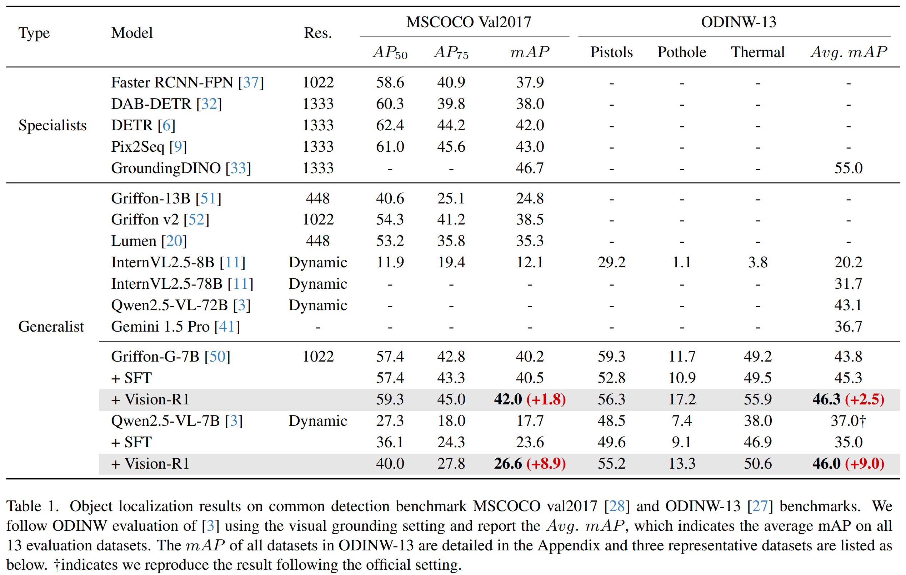

<!-- <div align="center">

## Vision-R1: Evolving Human-Free Alignment in Large Vision-Language Models via Vision-Guided Reinforcement Learning

</div> -->

<div align="center">

<h1>  Vision-R1: Evolving Human-Free Alignment in Large Vision-Language Models via Vision-Guided Reinforcement Learning </h1>

<h5 align="center"> If you find this project useful, please give us a star🌟.

<h5 align="center"> 

<a href='https://arxiv.org/abs/2503.18013'></a>
<a href='https://huggingface.co/collections/JefferyZhan/vision-r1-67e166f8b6a9ec3f6a664262'></a>
<a href='https://huggingface.co/datasets/JefferyZhan/Vision-R1-Data'></a>
[](https://github.com/jefferyZhan/Griffon)

</h5>
</div>

## News
- [x] **`May 26, 2025.`** **Update inference code.**
- [x] **`Mar 26, 2025.`** The training codes for Qwen2.5-VL model have been released.
- [x] **`Mar 24, 2025.`** The training codes of both models will be released later this week
- [x] **`Mar 24, 2025.`** We release our paper in [arxiv](https://arxiv.org/abs/2503.18013), evaluation codes, models in [huggingface](https://huggingface.co/collections/JefferyZhan/vision-r1-67e166f8b6a9ec3f6a664262), and data in [huggingface](https://huggingface.co/datasets/JefferyZhan/Vision-R1-Data).

## Setup
```bash
# Clone the repo
git clone git@github.com:jefferyZhan/Griffon.git
# Create Env and install basic packages
conda create -n vision-r1 python=3.11
cd Vision-R1
pip install -r requirements.txt
# Install Additional modules
pip install wandb==0.18.3
pip install tensorboardx
pip install qwen_vl_utils torchvision
pip install flash-attn --no-build-isolation
# Install griffon for quite evaluation
cd ..
pip install .
```

## Inference
You can use the code below for inference. Replace the prompt and image path to yours, but remember to follow the official prompts, which we summarize below, to get the best results. Different from the official demo, the ```use_cache=True``` is necessary. If you want to visualize the result, use the inference code in the eval folder.
```
from transformers import Qwen2_5_VLForConditionalGeneration, AutoProcessor
from qwen_vl_utils import process_vision_info
model = Qwen2_5_VLForConditionalGeneration.from_pretrained(
    "JefferyZhan/Qwen2.5-VL-7B-Instruct-Vision-R1", torch_dtype="auto", device_map="auto"
)

# default processor
processor = AutoProcessor.from_pretrained("JefferyZhan/Qwen2.5-VL-7B-Instruct-Vision-R1",use_fast=True,min_pixels=28*28,max_pixels=12800*28*28)

start_time = time.time()
messages = [
    {
        "role": "user",
        "content": [
            {
                "type": "image",
                "image": image_path, ##Replace it with your path##
            },
            {"type": "text", "text": "Please first output bbox coordinates and names of every item in this image in JSON format."},
        ],
    }
]
# Prompt Exmples following the offical setting and trained data
# Please first output bbox coordinates and names of every item in this image in JSON format.
# Outline the position of each small cake and output all the coordinates in JSON format.
# Locate the top right brown cake, output its bbox coordinates using JSON format.
# Locate every item from the category list in the image and output the coordinates in JSON format. The category set includes <category set,replace this with specific 80 categories for coco test without "<>">. 

# Preparation for inference
text = processor.apply_chat_template(
    messages, tokenize=False, add_generation_prompt=True
)
image_inputs, video_inputs = process_vision_info(messages)
inputs = processor(
    text=[text],
    images=image_inputs,
    videos=video_inputs,
    padding=True,
    return_tensors="pt",
)
inputs = inputs.to(model.device)

# Inference: Generation of the output
generated_ids = model.generate(**inputs, use_cache=True, max_new_tokens=1024)
generated_ids_trimmed = [
    out_ids[len(in_ids) :] for in_ids, out_ids in zip(inputs.input_ids, generated_ids)
]
output_text = processor.batch_decode(
    generated_ids_trimmed, skip_special_tokens=True, clean_up_tokenization_spaces=False
)
print(f"Inference Time: {inference_time:.4f} s\nOutput:\n")
print(output_text[0])
```

## Training
Current released codes support Qwen2.5-VL models Vision-R1 training and SFT. Codes for Griffon model will be released later after reformatting and checking.
#### 1. Vision-R1 Training
- Download the Vision-R1-Data from the [huggingface](https://huggingface.co/datasets/JefferyZhan/Vision-R1-Data) and modify the path in the run_qwen_vision_r1.sh if you can't download the dataset directly.
- Download the Qwen2.5-VL model from the [official repo](https://huggingface.co/collections/Qwen/qwen25-vl-6795ffac22b334a837c0f9a5).
- Modify the wandb host, hostfile, and model path setting. The default script requires 2 nodes * 8 GPUs with a total batch size of 16. Set the gradient_accumulation_steps to 2 to reduce the GPU usage to 1 node.
- Run the below command.
```bash 
bash run_qwen_vision_r1.sh 
```
#### 2.Supervised Fine-tuning
- Prepare the data and model following above instructions.
- Modify the model path in configs/qwen25vl_sft_config.yaml, and run the below command. This training requires 1 node.

```bash
accelerate launch --config_file configs/zero2.yaml vision_r1/sft_qwen.py --config configs/qwen25vl_sft_config.yaml 
```


## Evaluation
We provide the object localization evaluation script to evaluate the models' performance on benchmarks used in the paper. This script support Griffon-G, Qwen2.5-VL, InternVL-2.5, and Ferret, but the usage for InternVL-2.5 and Ferret requires the corresponding env following their repos.

- Download the [COCO](https://cocodataset.org/#download) and [ODINW](https://huggingface.co/GLIPModel/GLIP/tree/main/odinw_35) annotations and images.
- Create the dataset folder and unzip them in the dataset folder.
- Modify the query input (indicated in the sh script) and dataset name (indicated in the py script) based on the model and task to be evaluated.
- Run the following command, which requires 8 GPUs.

```bash
bash eval_localization.sh [MODEL_PATH] [MODEL_TYPE] [DATASET]
```
Multiple datasets evaluation is supported with dataset names splited by comma.


## Main Results
We conduct extensive experiments using two baseline models, including [Griffon-G-7B](https://arxiv.org/abs/2410.16163) and [Qwen2.5-VL-7B](https://arxiv.org/abs/2502.13923), on full object detection benchmark MSCOCO and ODINW-13. The main results posted here compare the Vision-R1 enhanced models with SOTA models and baseline models. **Vision-R1 improves the performance up to 50% and enhances the model to surpass the 72B model.** More results can be found in the paper.

<div align=center>

</div>

## Citation

If you find our repository useful, please star this repo and cite our paper.
```bibtex
@misc{zhan2025visionr1evolvinghumanfreealignment,
      title={Vision-R1: Evolving Human-Free Alignment in Large Vision-Language Models via Vision-Guided Reinforcement Learning}, 
      author={Yufei Zhan and Yousong Zhu and Shurong Zheng and Hongyin Zhao and Fan Yang and Ming Tang and Jinqiao Wang},
      year={2025},
      eprint={2503.18013},
      archivePrefix={arXiv},
      primaryClass={cs.CV},
      url={https://arxiv.org/abs/2503.18013}, 
}
```

## Acknowledgement
Our work is primarily based on the following codebases. We are sincerely grateful for their work.
- [R1-V](https://github.com/Deep-Agent/R1-V): We develop our project based on R1-V codes.
- [VLMEvalKit](https://github.com/open-compass/VLMEvalKit): We use VLMEvalKit for evaluation in our paper.
